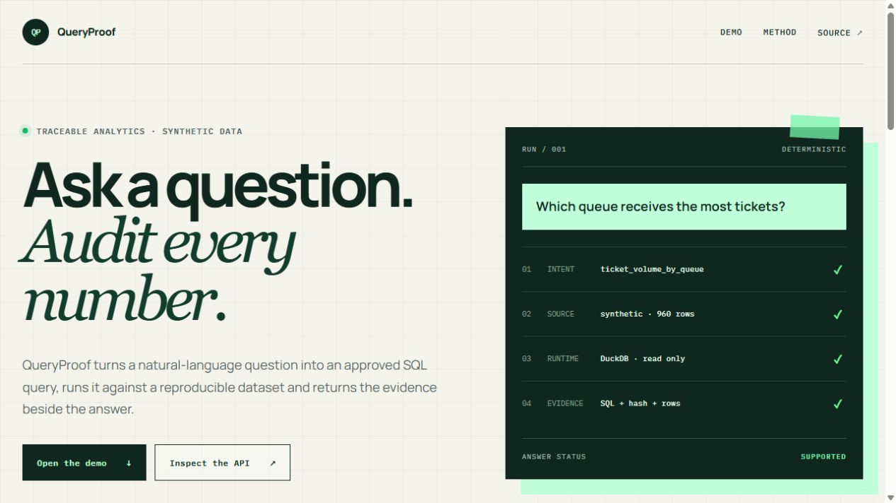
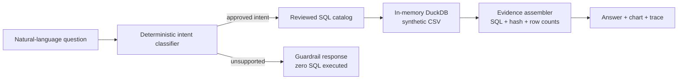

# QueryProof

Traceable analytics over synthetic data: ask a question, inspect the executed SQL,
and verify every number.

[](https://github.com/jord-andrade/queryproof/actions/workflows/ci.yml)
[](https://queryproof-theta.vercel.app)
[](./LICENSE)

[Live demo](https://queryproof-theta.vercel.app) ·
[API documentation](https://queryproof-theta.vercel.app/api/docs) ·
[Architecture](./docs/architecture.md) ·
[Data contract](./docs/data-contract.md) ·
[Threat model](./docs/threat-model.md)



## Why this exists

Analytics assistants can produce plausible numbers without enough evidence to
reproduce them. QueryProof demonstrates a deliberately constrained alternative:
natural-language questions map to reviewed analytical intents, only allowlisted
SQL can run, and the result includes the query, dataset fingerprint, row counts,
chart values, and execution trace.

This is a public engineering demonstration, not a general-purpose text-to-SQL
system. It uses no paid API key and never sends data to a model.

## What it does

- answers six useful questions about a synthetic support operation;
- executes reviewed, read-only SQL in an isolated in-memory DuckDB database;
- returns a visible evidence packet with SHA-256 source identity and row counts;
- renders an accessible result chart without a charting dependency;
- stops unsupported questions before SQL execution;
- exposes a typed FastAPI contract and interactive OpenAPI documentation;
- reproduces the complete 960-row dataset from a public seed-based generator.

## How it works



The browser calls `/api/analyze` on the same origin. In development, Next.js
proxies `/api/*` to Uvicorn; in production, Vercel routes the same paths to the
Python function. The public URL and API therefore require no CORS exception.

## Evidence and quality

| Evidence | Current result |
|---|---:|
| Evaluation questions | 24 / 24 mapped to the expected intent |
| Synthetic records | 960, generated with seed `42` |
| Approved SQL intents | 6 |
| Arbitrary user SQL | 0 paths |
| Python + API tests | 10 |
| TypeScript tests | 3 |
| Production health check | [`/api/health`](https://queryproof-theta.vercel.app/api/health) |

CI regenerates the dataset and fails if the committed fixture changes, checks
for identity/contact fields, runs strict Python and TypeScript type checks,
executes both test suites, builds the production frontend, and audits production
dependencies.

## Run locally

Prerequisites: Node.js 24, npm 11.17, Python 3.12, and
[uv](https://docs.astral.sh/uv/).

```bash
npm ci
uv sync --frozen --group dev
npm run dev
```

Open <http://localhost:3000>. The frontend starts on port `3000` and FastAPI on
port `8000`.

To run each service separately:

```bash
uv run uvicorn api.index:app --reload --port 8000
LOCAL_API_ORIGIN=http://127.0.0.1:8000 npm run dev:web
```

PowerShell equivalent for the second command:

```powershell
$env:LOCAL_API_ORIGIN = "http://127.0.0.1:8000"
npm run dev:web
```

## Quality commands

```bash
npm run check
uv run pytest
uv run ruff check .
uv run ruff format --check .
uv run mypy api queryproof scripts
uv run pip-audit -r requirements.txt
uv run python scripts/generate_data.py
git diff --exit-code -- data/support_tickets.csv
```

## API

| Method | Path | Purpose |
|---|---|---|
| `GET` | `/api` | Discover the public contract |
| `GET` | `/api/health` | Runtime and dataset identity |
| `GET` | `/api/schema` | Public synthetic table schema |
| `GET` | `/api/examples` | Supported example questions |
| `POST` | `/api/analyze` | Return answer, chart, SQL, evidence, and trace |
| `GET` | `/api/docs` | Interactive OpenAPI documentation |

Example:

```bash
curl -X POST https://queryproof-theta.vercel.app/api/analyze \
  -H "content-type: application/json" \
  -d '{"question":"Which queue receives the most tickets?"}'
```

## Security and privacy boundaries

- All records are generated locally; no private source data was copied.
- The schema intentionally contains no person, agent, supervisor, email, phone,
  account, customer, or message fields.
- User text is classified but never interpolated into SQL.
- Every executable query is a constant in `queryproof/catalog.py`.
- Inputs are limited to 6–300 characters and outputs to at most 50 chart rows.
- DuckDB runs in memory with one worker thread and no persistent database.
- Generic server errors do not return stack traces to clients.

See the full [threat model](./docs/threat-model.md) and
[data contract](./docs/data-contract.md).

## Trade-offs and limitations

- The intent classifier is deterministic and English-only. This makes behavior
  auditable and key-free, but it cannot answer arbitrary analytical questions.
- The six SQL statements are reviewed fixtures, not model-generated SQL. That
  removes arbitrary execution risk at the cost of flexibility.
- The dataset is intentionally small and synthetic. Results demonstrate the
  evidence path, not production forecasting or real operational performance.
- In-memory DuckDB is ideal for a low-cost public demo; a multi-tenant system
  would need workload isolation, quotas, persistent lineage, and authentication.

## Roadmap

- add adversarial and multilingual evaluation cases;
- persist a downloadable evidence receipt for each run;
- add structured trace export compatible with OpenTelemetry.

## License

[MIT](./LICENSE) © Jordan Andrade.
