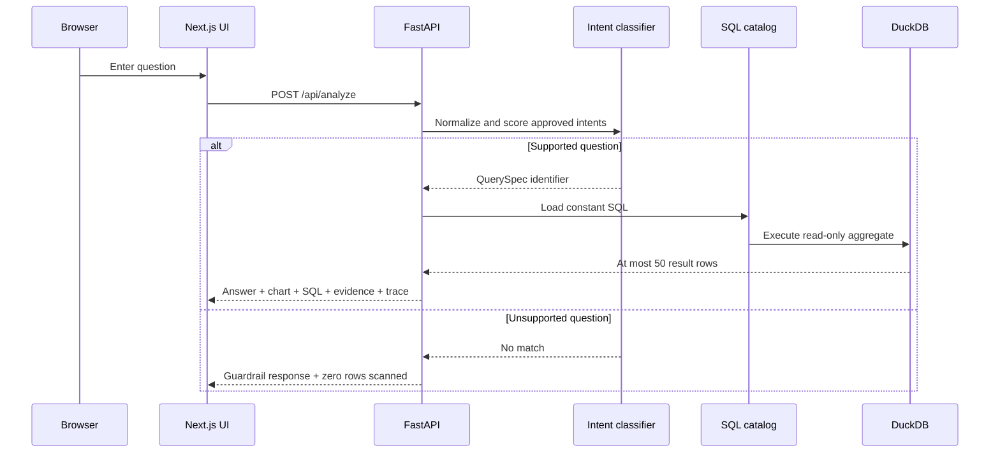

# Architecture

QueryProof is a same-origin hybrid application: Next.js renders the product UI,
and FastAPI executes the deterministic analysis path. Both deploy as one Vercel
project.

## Request flow

## Components

### Interface

- Next.js App Router and React Server Components for the static shell.
- One client component owns question input and request state.
- Native HTML controls and CSS-rendered bars keep the critical interaction
  keyboard-accessible without adding a visualization runtime.
- Dynamic Open Graph and icon routes are generated at build time.

### API

- `api/index.py` exports the ASGI `app` Vercel expects.
- Pydantic bounds and validates request and response contracts.
- Middleware adds a request ID, processing time, and `nosniff` header.
- The exception boundary returns a stable public message instead of internals.

### Analysis engine

- `interpreter.py` normalizes text and scores phrases/tokens against six intents.
- `catalog.py` is the complete executable SQL surface.
- `engine.py` creates a fresh in-memory DuckDB connection for each analysis,
  materializes the synthetic CSV, executes one catalog query, and assembles the
  evidence response.
- Unsupported inputs never open a database connection.

### Data

- `scripts/generate_data.py` uses `random.Random(42)` and fixed business rules.
- The generated CSV is committed so the public demo has no network dependency.
- CI regenerates the file and compares it byte-for-byte with the committed copy.

## Deployment routing

Locally, `LOCAL_API_ORIGIN` enables a Next.js rewrite from `/api/:path*` to the
Uvicorn process. On Vercel, `vercel.json` maps `/api` and `/api/:path*` to the
Python entrypoint while keeping the browser-visible path unchanged.

No secret or paid integration is required for build or runtime.
